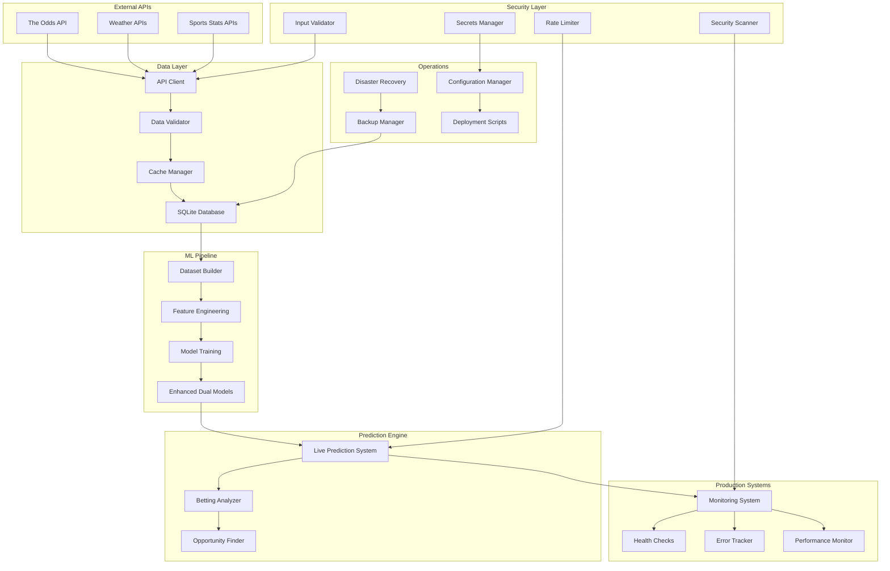
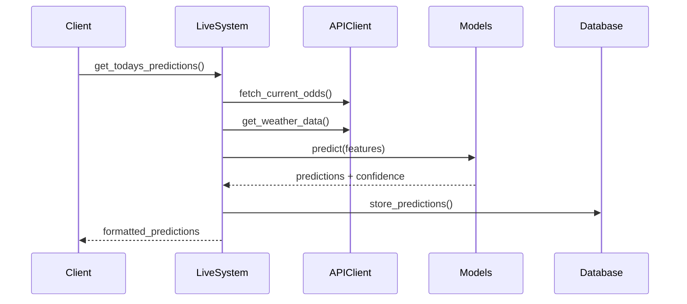
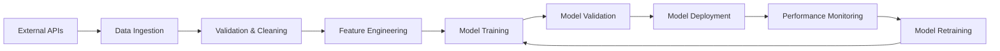
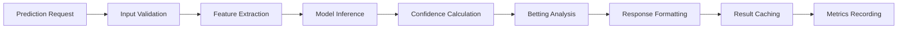
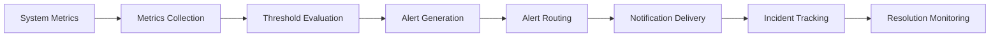
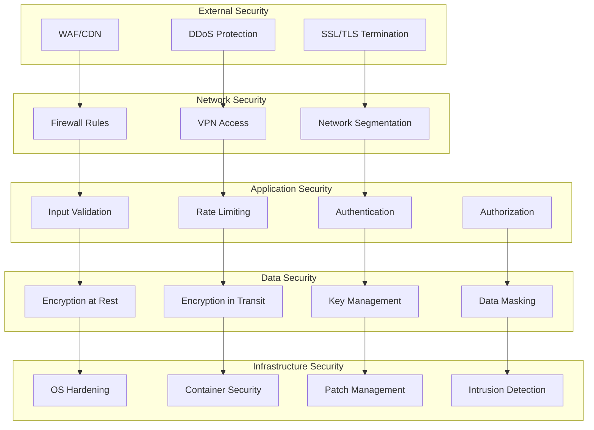
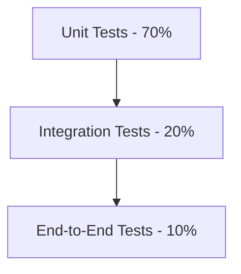

# System Architecture Documentation

## 🏗️ Overview

The Baseball Home Run Prediction System is built as a modular, production-ready machine learning platform designed for scalability, reliability, and maintainability. The architecture follows microservices principles with clear separation of concerns.

## 🎯 System Design Principles

### Core Principles
- **Modularity**: Loosely coupled components with clear interfaces
- **Scalability**: Horizontal scaling capability for high-throughput scenarios
- **Reliability**: Built-in error handling, monitoring, and recovery mechanisms  
- **Security**: Defense-in-depth security with multiple layers
- **Observability**: Comprehensive logging, monitoring, and alerting
- **Performance**: Sub-second response times with efficient resource usage

### Architecture Patterns
- **Layered Architecture**: Clear separation between data, business logic, and presentation
- **Event-Driven Design**: Asynchronous processing for non-blocking operations
- **CQRS Pattern**: Command Query Responsibility Segregation for read/write optimization
- **Circuit Breaker**: Fault tolerance for external service dependencies

## 🏛️ High-Level Architecture



## 🔧 Component Architecture

### 1. Data Layer

#### API Client (`api_client.py`)
**Purpose**: Unified interface for external data sources  
**Key Features**:
- Rate limiting and retry logic
- Response caching and validation
- Circuit breaker for fault tolerance
- Comprehensive error handling

```python
class SafeAPIClient:
    def __init__(self, api_key: str, cache_ttl: int = 300)
    def fetch_current_odds(self, sport: str, markets: List[str])
    def get_weather_data(self, location: str, date: str)
    def test_api_health(self) -> Dict[str, Any]
```

**Interaction Patterns**:
- Synchronous calls with timeout handling
- Automatic retry with exponential backoff
- Response caching with TTL-based invalidation

#### Data Validation (`data_utils.py`)
**Purpose**: Ensure data quality and consistency  
**Key Features**:
- Schema validation for incoming data
- Data type conversion and standardization
- Outlier detection and handling
- Missing value imputation strategies

```python
class DataValidator:
    @staticmethod
    def validate_game_data(game_data: Dict) -> bool
    @staticmethod
    def standardize_player_name(name: str) -> str
    @staticmethod
    def validate_odds_data(odds: Dict) -> bool
```

#### Database Management (`matchup_database.py`)
**Purpose**: Persistent data storage and retrieval  
**Key Features**:
- SQLite with WAL mode for concurrency
- Connection pooling for performance
- Automatic backup and recovery
- Query optimization and indexing

**Schema Design**:
```sql
-- Games table
CREATE TABLE games (
    game_id TEXT PRIMARY KEY,
    home_team TEXT NOT NULL,
    away_team TEXT NOT NULL,
    game_date DATE NOT NULL,
    home_runs INTEGER,
    weather_data JSON,
    created_at TIMESTAMP DEFAULT CURRENT_TIMESTAMP
);

-- Predictions table  
CREATE TABLE predictions (
    prediction_id TEXT PRIMARY KEY,
    game_id TEXT REFERENCES games(game_id),
    prediction_type TEXT NOT NULL,
    predicted_value REAL NOT NULL,
    confidence REAL NOT NULL,
    model_version TEXT NOT NULL,
    created_at TIMESTAMP DEFAULT CURRENT_TIMESTAMP
);

-- Betting opportunities table
CREATE TABLE betting_opportunities (
    opportunity_id TEXT PRIMARY KEY,
    game_id TEXT REFERENCES games(game_id),
    bet_type TEXT NOT NULL,
    odds REAL NOT NULL,
    expected_value REAL NOT NULL,
    recommended_stake REAL,
    outcome TEXT,
    created_at TIMESTAMP DEFAULT CURRENT_TIMESTAMP
);
```

### 2. Machine Learning Pipeline

#### Dataset Builder (`dataset_builder.py`)
**Purpose**: Feature engineering and data preparation  
**Key Features**:
- 255+ engineered features
- Time-based feature windows
- Cross-validation splits
- Feature importance tracking

**Feature Categories**:
- **Player Features**: Career stats, recent performance, matchup history
- **Environmental**: Weather conditions, ballpark factors, altitude
- **Game Context**: Inning situation, score, base runners
- **Advanced Metrics**: Expected stats, park-adjusted performance

#### Enhanced Dual Model System (`modeling.py`)
**Purpose**: Machine learning model management  
**Key Features**:
- Primary XGBoost classifier
- Secondary ensemble model
- Automated hyperparameter tuning
- Model versioning and rollback

**Model Architecture**:
```python
class EnhancedDualModelSystem:
    def __init__(self, model_dir: str, splitting_strategy: str = "time_based")
    
    # Core model (XGBoost)
    self.core_model: XGBClassifier
    
    # Enhanced model (Ensemble)  
    self.enhanced_model: VotingClassifier
    
    # Feature processor
    self.feature_processor: FeatureProcessor
    
    # Model metadata
    self.model_metadata: Dict[str, Any]
```

**Training Pipeline**:
1. Data validation and cleaning
2. Feature engineering and selection
3. Time-based train/validation split
4. Hyperparameter optimization
5. Model training and validation
6. Performance evaluation and comparison
7. Model serialization and deployment

### 3. Prediction Engine

#### Live Prediction System (`live_prediction_system.py`)
**Purpose**: Real-time prediction generation  
**Key Features**:
- Multi-model prediction aggregation
- Confidence interval calculation
- Performance monitoring
- Result caching

**Prediction Workflow**:


#### Betting Analysis Engine (`betting_utils.py`)
**Purpose**: Betting opportunity identification and analysis  
**Key Features**:
- Expected value calculations
- Kelly criterion for stake sizing
- Risk assessment and management
- Performance tracking

```python
class BettingAnalyzer:
    def __init__(self, min_ev: float = 0.05, min_probability: float = 0.15)
    
    def analyze_bet(self, prediction_prob: float, bookmaker_odds: float) -> BettingOpportunity
    def calculate_expected_value(self, true_prob: float, odds: float) -> float
    def calculate_optimal_stake(self, bankroll: float, ev: float, confidence: float) -> float
```

### 4. Production Systems

#### Integrated Monitoring (`monitoring/monitoring_integration.py`)
**Purpose**: Comprehensive system observability  
**Key Features**:
- Real-time metrics collection
- Automated alerting
- Performance dashboards
- Historical trend analysis

**Monitoring Architecture**:
```python
class IntegratedMonitoringSystem:
    def __init__(self):
        self.system_monitor = SystemMonitor()
        self.error_tracker = ErrorTracker()
        self.performance_monitor = PerformanceMonitor()
        self.health_checker = HealthChecker()
```

**Metrics Collection**:
- System metrics (CPU, memory, disk)
- Application metrics (predictions, latency)
- Business metrics (opportunities, ROI)
- Custom metrics (model performance)

#### Error Tracking (`monitoring/error_tracker.py`)
**Purpose**: Centralized error management  
**Key Features**:
- Error classification and aggregation
- Automated alerting rules
- Root cause analysis
- Incident management

**Alert Rules**:
- High error rate (>10 errors/minute)
- API failures (>5 failures/minute)  
- Model prediction failures (>3 failures/10 minutes)
- Critical system errors (immediate notification)

#### Health Checks (`monitoring/health_checks.py`)
**Purpose**: System health validation  
**Key Features**:
- Component health validation
- Dependency checking
- Performance benchmarking
- Automated remediation

**Health Check Categories**:
- **Infrastructure**: Database connectivity, disk space, memory
- **Services**: API availability, model loading, cache status
- **Data Quality**: Recent data availability, data freshness
- **Performance**: Response times, throughput, error rates

### 5. Security Layer

#### Input Validation (`security/security_validator.py`)
**Purpose**: Data sanitization and validation  
**Key Features**:
- Schema-based validation
- SQL injection prevention
- XSS protection
- Rate limiting

**Validation Patterns**:
```python
class InputValidator:
    PATTERNS = {
        'team_name': re.compile(r'^[A-Z]{2,4}$'),
        'date': re.compile(r'^\d{4}-\d{2}-\d{2}$'),
        'player_name': re.compile(r'^[a-zA-Z\s\'\-\.]{1,50}$'),
        'numeric': re.compile(r'^-?\d*\.?\d+$'),
        'api_key': re.compile(r'^[a-zA-Z0-9]{16,64}$')
    }
```

#### Secrets Management (`config/secrets_manager.py`)
**Purpose**: Secure credential storage  
**Key Features**:
- Fernet encryption for secrets at rest
- Environment variable integration
- Key rotation support
- Audit logging

**Security Model**:
- Encryption keys stored separately from data
- Environment-specific secret isolation
- Regular key rotation (90-day cycle)
- Access logging and monitoring

### 6. Operations Layer

#### Backup System (`backup/backup_manager.py`)
**Purpose**: Data protection and recovery  
**Key Features**:
- Automated backup scheduling
- Incremental and full backups
- Backup verification and integrity checks
- Configurable retention policies

**Backup Strategy**:
```python
BACKUP_SCHEDULE = {
    'databases': 'daily',
    'models': 'weekly',
    'configuration': 'on_change',
    'logs': 'weekly'
}

RETENTION_POLICY = {
    'database_backups': 30,  # days
    'model_backups': 90,     # days
    'config_backups': 365,   # days
    'log_backups': 7         # days
}
```

#### Disaster Recovery (`backup/disaster_recovery_plan.py`)
**Purpose**: Business continuity planning  
**Key Features**:
- Automated recovery procedures
- RTO/RPO objectives
- Recovery testing
- Incident response workflows

**Recovery Scenarios**:
- Database corruption (RTO: 30 min, RPO: 1 hour)
- Configuration loss (RTO: 15 min, RPO: 6 hours)
- Model loss (RTO: 45 min, RPO: 12 hours)
- Complete system failure (RTO: 2 hours, RPO: 4 hours)

## 🔄 Data Flow Architecture

### Batch Processing Pipeline



### Real-time Prediction Pipeline



### Monitoring & Alerting Pipeline



## 🚀 Deployment Architecture

### Single-Node Deployment

```yaml
# Production deployment configuration
Production Environment:
  Hardware Requirements:
    CPU: 4 cores minimum, 8 cores recommended
    Memory: 8GB minimum, 16GB recommended
    Storage: 100GB SSD minimum
    Network: 1Gbps connection
  
  Software Stack:
    OS: Ubuntu 20.04 LTS or CentOS 8
    Python: 3.8+ with virtual environment
    Database: SQLite with WAL mode
    Web Server: Optional (for API endpoints)
    Process Manager: systemd or supervisor
  
  Security:
    Firewall: UFW with minimal open ports
    SSL/TLS: Let's Encrypt certificates
    User Access: Non-root user with sudo access
    File Permissions: Restrictive file permissions
```

### Multi-Node Deployment (Future)

```yaml
# Scalable deployment architecture
Load Balancer:
  Type: nginx or HAProxy
  SSL Termination: Yes
  Health Checks: /health endpoint

Application Servers:
  Count: 2-4 instances
  Auto-scaling: Based on CPU/memory
  Session Management: Stateless design

Database:
  Primary: PostgreSQL for transactional data
  Cache: Redis for session/prediction caching
  Backup: Automated with point-in-time recovery

Monitoring:
  Metrics: Prometheus + Grafana
  Logging: ELK Stack (Elasticsearch, Logstash, Kibana)
  Alerting: PagerDuty or Slack integration
```

## 📊 Performance Architecture

### Caching Strategy

```python
# Multi-layer caching architecture
CACHE_LAYERS = {
    'L1_Memory': {
        'type': 'in_process',
        'ttl': 300,  # 5 minutes
        'max_size': '100MB',
        'use_cases': ['model_predictions', 'feature_cache']
    },
    'L2_Redis': {
        'type': 'distributed',
        'ttl': 3600,  # 1 hour  
        'max_size': '1GB',
        'use_cases': ['api_responses', 'user_sessions']
    },
    'L3_Database': {
        'type': 'persistent',
        'ttl': 86400,  # 24 hours
        'use_cases': ['historical_data', 'model_artifacts']
    }
}
```

### Database Optimization

```sql
-- Database indexing strategy
CREATE INDEX idx_games_date ON games(game_date);
CREATE INDEX idx_games_teams ON games(home_team, away_team);
CREATE INDEX idx_predictions_game ON predictions(game_id);
CREATE INDEX idx_predictions_created ON predictions(created_at);
CREATE INDEX idx_opportunities_ev ON betting_opportunities(expected_value DESC);

-- Query optimization
-- Use covering indexes for frequently accessed columns
CREATE INDEX idx_games_summary ON games(game_id, home_team, away_team, game_date, home_runs);
```

### Scalability Considerations

**Horizontal Scaling**:
- Stateless application design
- Database read replicas
- Load balancing with session affinity
- Microservices decomposition

**Vertical Scaling**:
- Memory optimization for model caching
- CPU optimization for prediction processing
- Storage optimization for historical data
- Network optimization for API calls

## 🔐 Security Architecture

### Defense in Depth



### Threat Model

**Identified Threats**:
- **Data Injection**: SQL injection, NoSQL injection, command injection
- **Authentication Bypass**: Weak credentials, session hijacking
- **Privilege Escalation**: Unauthorized access to admin functions
- **Data Exfiltration**: Unauthorized data access or theft
- **Denial of Service**: Resource exhaustion attacks

**Mitigation Strategies**:
- Input validation and parameterized queries
- Strong authentication and session management
- Role-based access control (RBAC)
- Data encryption and access logging
- Rate limiting and resource quotas

## 🧪 Testing Architecture

### Testing Pyramid



**Unit Tests**:
- Individual function and method testing
- Mock external dependencies
- Fast execution (< 1 second per test)
- High code coverage (> 80%)

**Integration Tests**:
- Component interaction testing
- Database and API integration
- Moderate execution time (< 30 seconds per test)
- Critical path coverage

**End-to-End Tests**:
- Full system workflow testing
- Production-like environment
- Slower execution (minutes per test)
- Business scenario coverage

### Continuous Integration

```yaml
# CI/CD Pipeline stages
stages:
  - lint_and_format
  - unit_tests
  - security_scan
  - integration_tests
  - performance_tests
  - deployment
  - smoke_tests
  - monitoring_setup

# Quality gates
quality_gates:
  code_coverage: ">= 80%"
  security_score: ">= 85/100"
  performance_regression: "< 10%"
  all_tests_passing: true
```

## 🔧 Configuration Architecture

### Configuration Hierarchy

```python
# Configuration precedence (highest to lowest)
CONFIG_SOURCES = [
    'command_line_arguments',  # --config-key value
    'environment_variables',   # BASEBALL_HR_CONFIG_KEY
    'environment_files',       # .env, .env.production
    'configuration_files',     # config.py, settings.json
    'default_values'          # Built-in defaults
]
```

### Environment Management

```python
# Environment-specific configuration
ENVIRONMENTS = {
    'development': {
        'debug': True,
        'log_level': 'DEBUG',
        'database_url': 'sqlite:///dev.db',
        'cache_ttl': 60
    },
    'staging': {
        'debug': False,
        'log_level': 'INFO', 
        'database_url': 'sqlite:///staging.db',
        'cache_ttl': 300
    },
    'production': {
        'debug': False,
        'log_level': 'WARNING',
        'database_url': 'sqlite:///production.db',
        'cache_ttl': 3600
    }
}
```

## 📈 Future Architecture Considerations

### Cloud-Native Migration

**Containerization**:
- Docker containers for application packaging
- Kubernetes orchestration for scaling
- Helm charts for deployment automation
- Container registry for image management

**Serverless Components**:
- AWS Lambda for prediction processing
- API Gateway for request routing
- CloudWatch for monitoring
- S3 for data storage

**Microservices Decomposition**:
- Prediction Service
- Data Ingestion Service  
- Betting Analysis Service
- Monitoring Service
- Configuration Service

### AI/ML Platform Integration

**MLOps Pipeline**:
- MLflow for model lifecycle management
- Kubeflow for ML workflow orchestration
- Feature stores for feature management
- Model serving infrastructure

**Advanced Analytics**:
- Stream processing with Apache Kafka
- Real-time feature computation
- A/B testing for model variants
- Automated model retraining

## 📚 Additional Resources

- **Deployment Guide**: `docs/deployment.md`
- **Security Guide**: `docs/security.md`
- **Performance Tuning**: `docs/performance.md`
- **Troubleshooting**: `docs/troubleshooting.md`
- **Development Setup**: `docs/development.md`

---

**Architecture Version**: 1.0.0  
**Last Updated**: August 2025  
**Review Cycle**: Quarterly